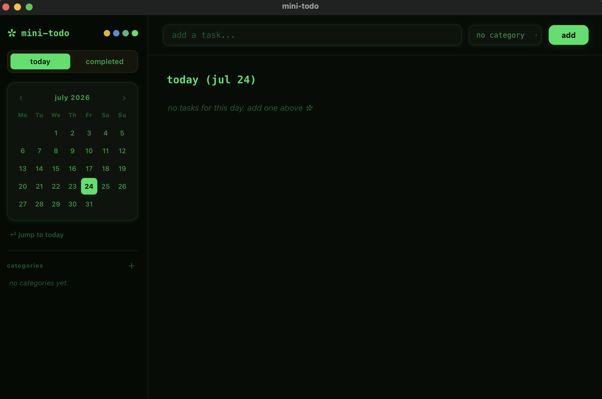
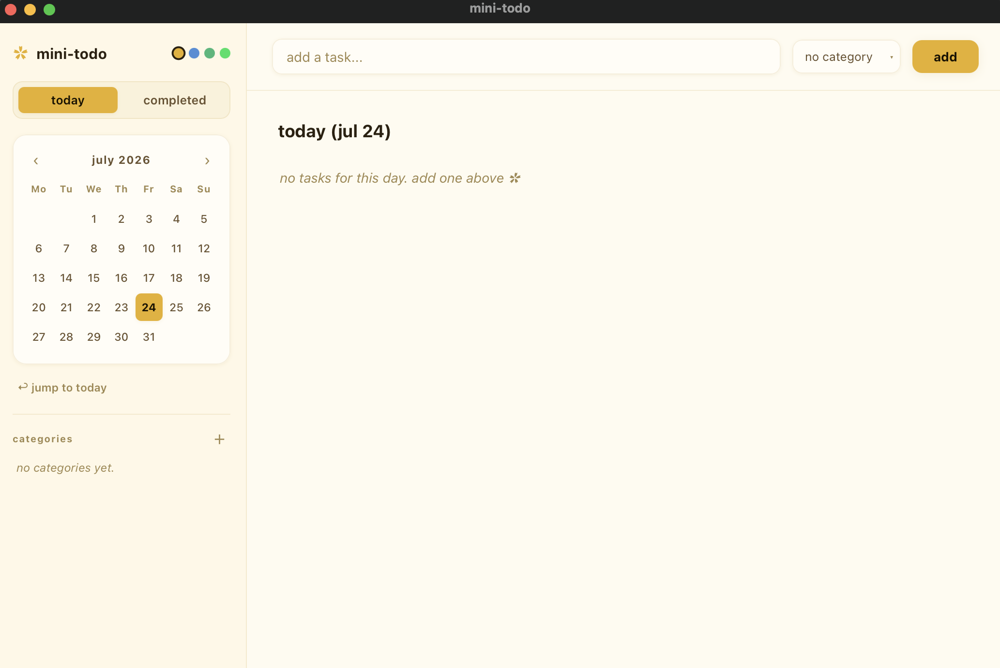

# ✿ cute todo-app

a minimal local to-do app with a warm butter yellow theme. calendar on the left to pick a day, today/completed tab switch, category tagging, and a clean task bar.

everything is stored in a `tasks.json` file next to `app.py` — nothing leaves your mac, no server, no account, no internet needed.

## about xcode

you don't need xcode for this. the only thing you might need is the **xcode command line tools**, a small free download that provides compiler tools some python packages need on macos:

```bash
xcode-select --install
```

one-time ~1 gb install — not the full xcode app (~15 gb).

## setup (one time)

```bash
# 1. go into the project folder
cd todo-app

# 2. create a virtual environment
python3 -m venv venv
source venv/bin/activate

# 3. install dependencies
venv/bin/python -m pip install -r requirements.txt
```

if `pywebview` fails with a compiler error, run `xcode-select --install` and try again.

## run it

```bash
source venv/bin/activate   # if not already active
python3 app.py
```

a window titled "mini-todo" opens. close the window to quit — your tasks stay in `tasks.json`.

## using the app

- **calendar (left)** — click any day to select it. use `‹` `›` to browse months, "jump to today" to snap back. a small dot under a date means it has tasks.
- **add a task** — type in the bar at the top, optionally pick a category from the dropdown, then press **add** or hit **enter**.
- **today tab** — shows open tasks for the selected day. click the circle to mark done; click the text to edit; `✕` on hover to delete.
- **completed tab** — shows finished tasks with the time they were completed.
- **categories (left panel, below calendar)** — click `＋` to create a new category. categories appear as colored badges on tasks and as a list in the sidebar. hover a category to delete it.

## app demo 





## notes

- data is a single local json file — fine for personal use.
- no cloud sync, no login — built for local, single-user use.
- all visual styles live in `ui/style.css` — colors and spacing are easy to tweak.
